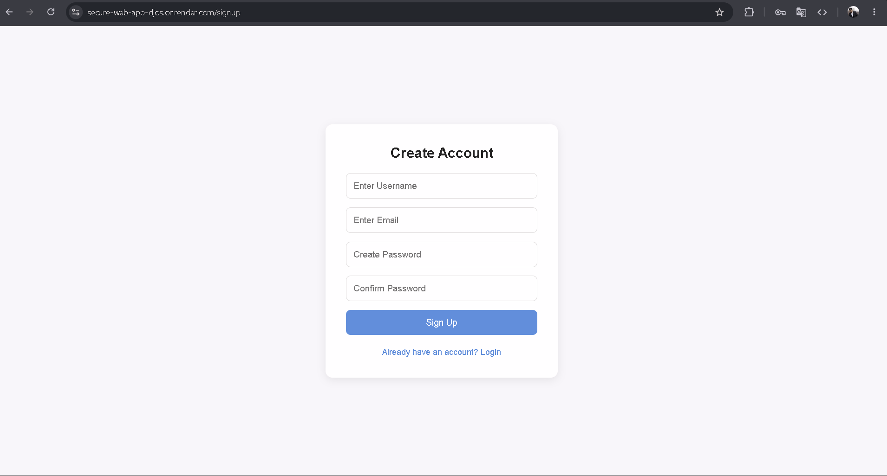
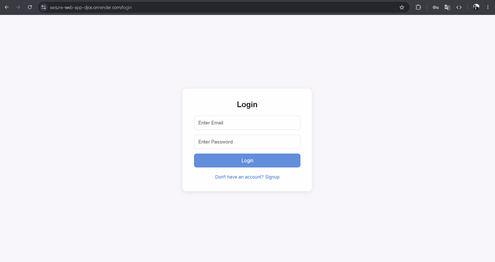
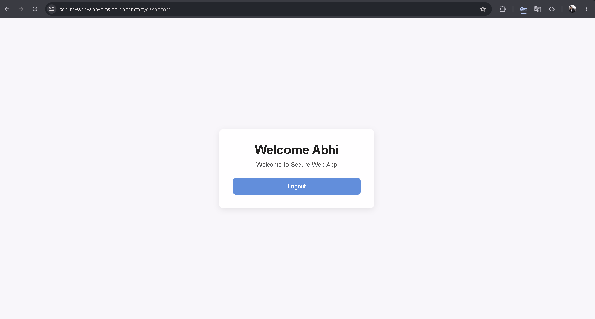
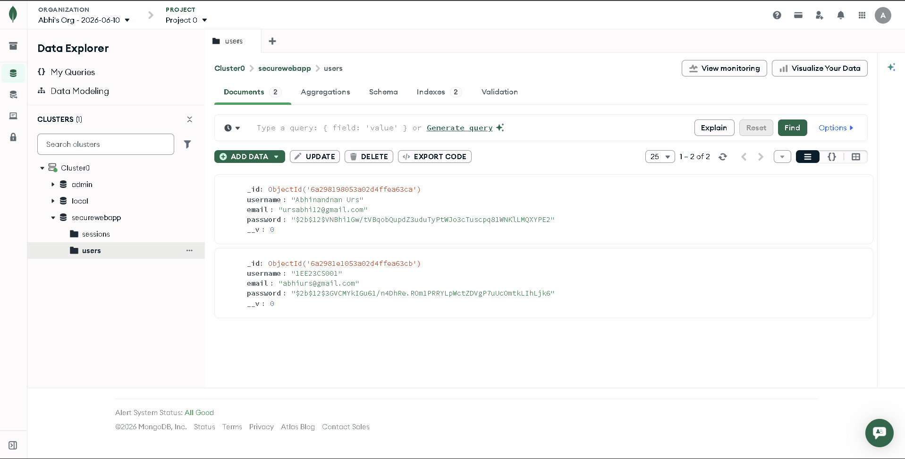
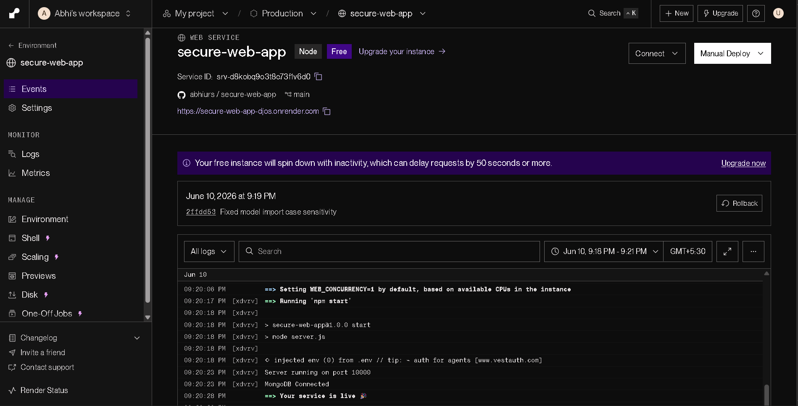
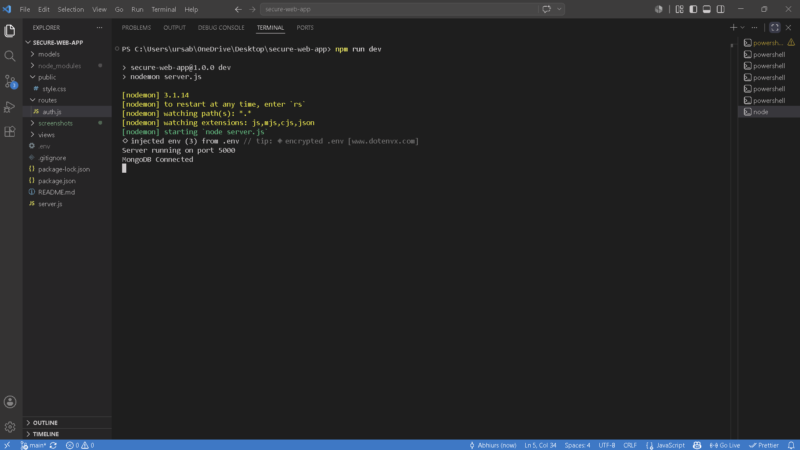

# Secure Web Application

A secure full-stack web application built using Node.js, Express.js, MongoDB Atlas, and EJS.  
This project implements secure user authentication with multiple security best practices including password hashing, session management, CSRF protection, and input validation.

---

## Live Demo

https://secure-web-app-djos.onrender.com

---

## Features

- User Signup & Login System
- Secure Authentication
- Password Hashing using bcryptjs
- Session Management using express-session
- CSRF Protection using csurf
- Input Validation using express-validator
- MongoDB Atlas Database Integration
- Protected Dashboard Route
- Responsive UI Design
- Logout Functionality
- Secure Environment Variables using dotenv

---

## Technologies Used

### Frontend
- HTML
- CSS
- EJS

### Backend
- Node.js
- Express.js

### Database
- MongoDB Atlas
- Mongoose

### Security & Authentication
- bcryptjs
- express-session
- csurf
- express-validator
- dotenv

### Deployment
- Render

---

## Project Structure

```bash
secure-web-app/
│
├── models/
│   └── User.js
│
├── routes/
│   └── auth.js
│
├── views/
│   ├── signup.ejs
│   ├── login.ejs
│   └── dashboard.ejs
│
├── public/
│   └── style.css
│
├── screenshots/
│   ├── signup.png
│   ├── login.png
│   ├── dashboard.png
│   ├── mongodb-database.png
│   ├── render-deployment.png
│   └── local-server-running.png
│
├── .env
├── .gitignore
├── package.json
├── package-lock.json
├── README.md
└── server.js
```

---

## Security Features Implemented

- Password Hashing with bcryptjs
- Session-Based Authentication
- CSRF Protection
- Input Validation & Sanitization
- MongoDB Injection Protection using Mongoose
- Secure Environment Variables
- Protected Routes

---

## Installation & Setup

### Clone Repository

```bash
git clone https://github.com/abhiurs/secure-web-app.git
```

### Navigate to Project Folder

```bash
cd secure-web-app
```

### Install Dependencies

```bash
npm install
```

### Configure Environment Variables

Create a `.env` file and add:

```env
MONGO_URI=your_mongodb_connection_string
SESSION_SECRET=your_secret_key
PORT=5000
```

### Run Application

```bash
npm run dev
```

---

## Screenshots

### Signup Page


### Login Page


### Dashboard


### MongoDB Database


### Render Deployment


### Local Server Running


---

Open in browser:

```text
http://localhost:5000
```

---

## Deployment

The application is deployed on Render and uses MongoDB Atlas cloud database.

Live URL:
https://secure-web-app-djos.onrender.com

---

## Future Improvements

- Email Verification
- Password Reset System
- JWT Authentication
- Dark Mode UI
- Rate Limiting
- User Profile Management
- Two-Factor Authentication

---

## Author

### Abhinandan Urs

GitHub: https://github.com/abhiurs

---

## License

This project is created for educational and portfolio purposes.
